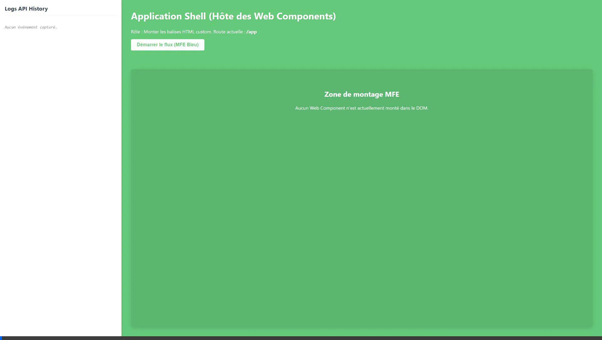
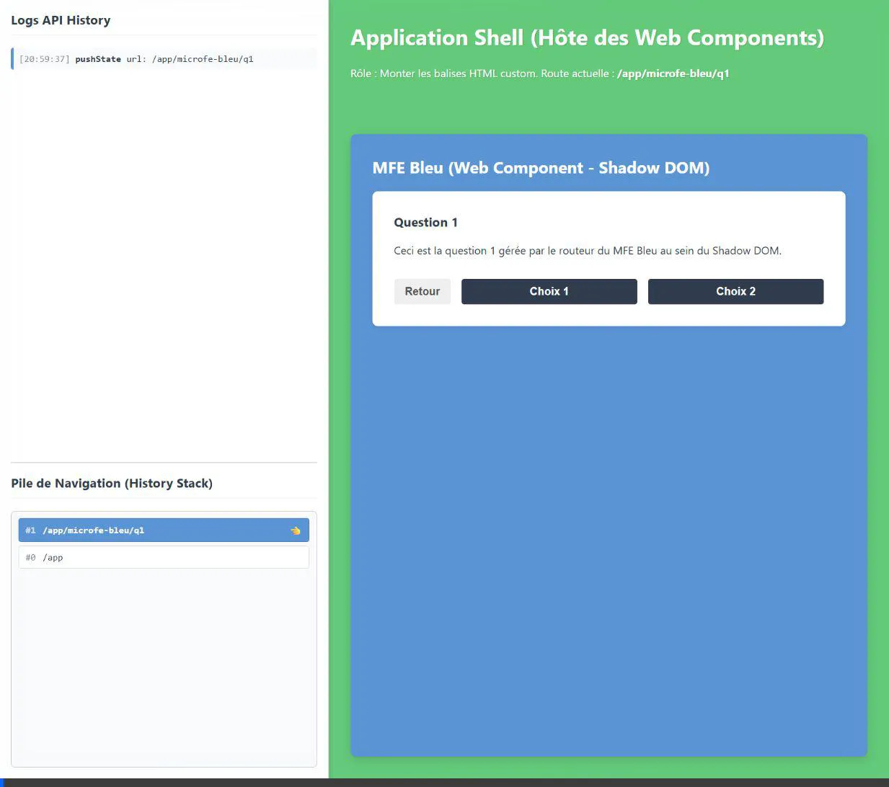
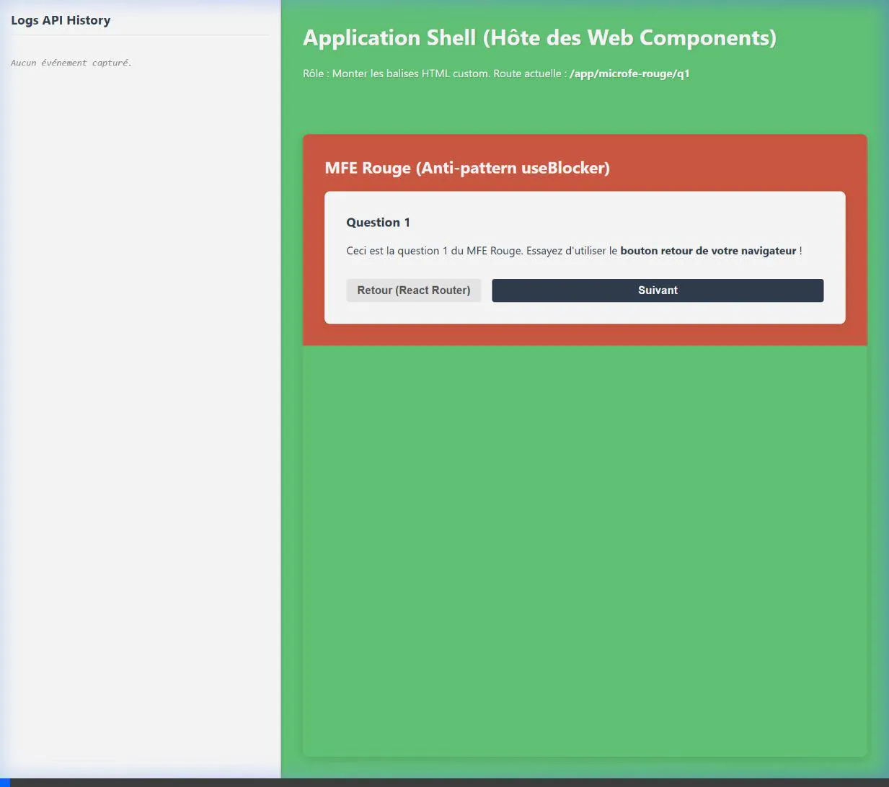

# 🧪 Microfrontend History API Laboratory

Ce projet est un Proof of Concept (POC) éducatif visant à démontrer le fonctionnement de l'API History d'un navigateur web couplé à React Router v6.4, au sein d'une architecture Microfrontend (MFE).

L'application est construite avec **React 18** et **Vite**, et s'articule autour d'une isolation technique forte utilisant les **Web Components (Shadow DOM)**.

## 🏗️ Architecture Technique

L'architecture repose sur un conteneur principal ("Shell") et trois Microfrontends distincts. Chaque MFE est totalement isolé : il possède son propre cycle de vie React (`createRoot`), ses propres styles encapsulés, et surtout, son **propre routeur interne**.

### 1. Le Shell (Application Hôte)
- **Rôle :** Gérer le routage de très haut niveau (`/app/*`) et monter dynamiquement les Web Components appropriés dans le DOM.
- **Interception :** Contient un logger global de l'API History (`pushState`, `replaceState`, `popstate`) qui écoute toutes les manipulations de la barre d'URL pour afficher en temps réel une copie virtuelle de la pile de navigation (History Stack).

### 2. MFE Bleu (`<mfe-bleu>`) : Navigation & Gestion d'État
- **Rôle :** Démontrer une navigation isolée au sein d'un composant métier, avec conservation de l'état local dans la pile d'historique.
- **Mécanique :** Les boutons de navigation utilisent les propriétés internes du routeur. Le choix effectué (Choix 1 ou 2) est sauvegardé de sorte qu'il reste surligné visuellement si l'utilisateur fait un "Retour Arrière" natif.

### 3. MFE Jaune (`<mfe-jaune>`) : Transition classique
- **Rôle :** Démontrer la transition fluide ("tunnel") entre deux Microfrontends distincts.
- **Communication :** Lorsqu'un MFE a terminé son tunnel, il émet un événement `window.dispatchEvent(new CustomEvent('cross-mfe-navigate'))`. Le Shell écoute cet événement et redirige vers le prochain MFE (cela respecte les bonnes pratiques de faible couplage en MFE).

### 4. MFE Rouge (`<mfe-rouge>`) : L'Anti-pattern `useBlocker`
- **Rôle :** Démontrer ce qu'il **ne faut pas faire** dans un environnement Microfrontend partagé.
- **Mécanique :** Utilise le hook `useBlocker` de React Router pour bloquer un retour arrière de l'utilisateur. 
- **La Leçon :** Lorsqu'on tente un retour arrière, on peut observer dans les logs que le navigateur déclenche naturellement un `popstate`. Le routeur du MFE, pour bloquer cette action, émet instantanément un "contre-popstate" fantôme (`pushState`) pour annuler la navigation. Manipuler la pile globale depuis un enfant isolé est extrêmement dangereux car cela risque de désynchroniser tous les autres routeurs de la page.

### 5. MFE Violet (`<mfe-violet>`) : Blocage & Communication Bidirectionnelle
- **Rôle :** Démontrer un cas d'usage avancé de contrôle de navigation entre l'hôte et l'enfant.
- **Mécanique :** Le MFE utilise `useBlocker` pour intercepter toute tentative de navigation. Contrairement au MFE Rouge, il n'offre pas la possibilité à l'utilisateur de "Forcer" directement le passage. Il attend passivement un événement de déblocage (`unlock-violet-navigation`).
- **Communication Bidirectionnelle :** L'application Shell détecte que le MFE Violet est monté. Elle affiche un bouton spécial "Débloquer" dans sa propre interface. Au clic, le Shell émet un `CustomEvent` que le MFE Violet capte pour libérer la navigation (`blocker.proceed()`). Cela illustre comment un Shell peut orchestrer des flux bloquants (ex: sauvegarde globale en attente) tout en gardant les composants isolés.

---

## 🎥 Démonstrations (Walkthrough)

### 1. Le Flux de Navigation Normal (MFE Bleu)
On observe le Shell qui monte le Web Component, et l'accumulation propre des `pushState` dans le navigateur.


### 2. La Pile d'Historique Virtuelle
Une heuristique permet de recréer visuellement l'état de la vraie pile d'historique du navigateur en bas à gauche.


### 3. L'Anti-pattern `useBlocker` (MFE Rouge)
Observez le pointeur bleu descendre puis "rebondir" vers le haut à cause de l'annulation forcée du navigateur.


---

## 🚀 Lancer le projet en local

1. Installer les dépendances :
```bash
npm install
```

2. Démarrer le serveur de développement :
```bash
npm run dev
```

3. Ouvrir votre navigateur sur `http://localhost:5173/`
